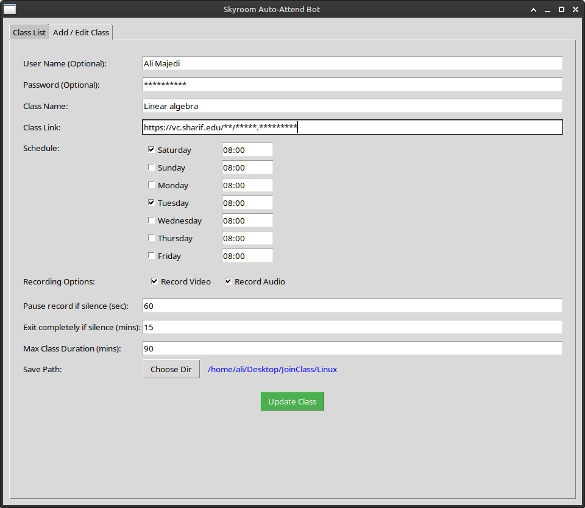
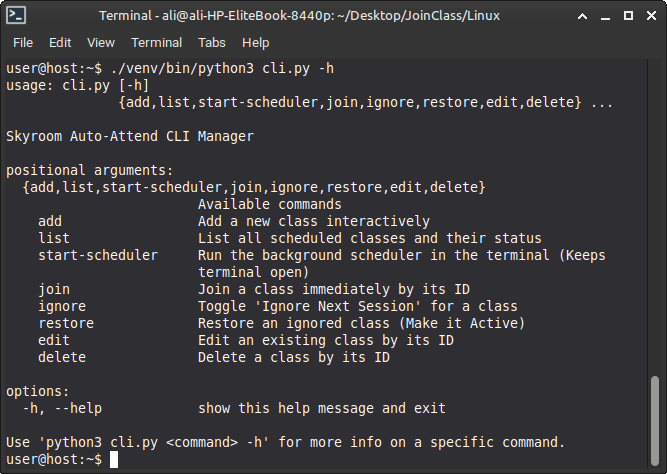

# 🎓 Skyroom Auto-Attend Bot


An advanced, automated Python application designed to automatically join scheduled Skyroom virtual classes, monitor audio activity (silence detection), and record class sessions efficiently. 

This repository contains two dedicated versions optimized for **Linux (PulseAudio)** and **Windows (WASAPI)**.

---

## 📂 Project Structure
- **`/Linux`**: The native Linux version using `sounddevice`, `PulseAudio`, and a `Makefile` for zero-config setup. Features a Dual GUI/CLI architecture.
- **`/Windows`**: The native Windows version using `pyaudiowpatch` and `WASAPI` loopback. Includes `.bat` scripts for a seamless, click-and-run experience.

---

## 🐧 Linux Edition Guide

### 🛠️ Setup & Installation
Thanks to the integrated `Makefile`, setting up the project takes only one command:
```bash
git clone https://github.com/AliMajedi-83/Skyroom-Auto-Attend.git
cd Skyroom-Auto-Attend/Linux
make setup
```
### 🚀 Usage

GUI Mode:
```Bash

make run
```



CLI Mode:
```Bash

./venv/bin/python3 cli.py -h
```


## 🪟 Windows Edition Guide

### 🚀 Setup & Usage
```Bash
Open the Windows folder.
```
```Bash
Double-click install.bat to install Python dependencies.
```
```Bash
Double-click run.bat to launch the GUI bot in the background.
```
### ⚠️ ChromeDriver Troubleshooting

Due to filtering, chromedriver.exe is pre-included in Windows/core/bin/. If the bot crashes, your Chrome browser version doesn't match the driver.

Fix: First update your **Chrome Browser**. Then download **chromedriver-win64** from https://googlechromelabs.github.io/chrome-for-testing/ and replace the file in core/bin/.

---
## ✨ Key Features & Pro Tips

*   **Smart Login:** The bot automatically handles joining classes as a **guest** or a **registered user**. **Tip:** To join as a guest, simply type your desired display name in the User Name field and leave the Password field completely **blank**. If you fill the password field, you will join as a registered user.


*   **"Ignore Next Session" Toggle:** Skip a single upcoming class (e.g., for a holiday) without deleting your permanent weekly schedule. **Tip:** Select a class from the list and click the "Ignore Next Session" button. The bot will skip the immediate next occurrence and automatically restore the schedule for the following weeks.
*   **Silence Detection & Resource Management:** Intelligently pauses the FFmpeg recording process during long periods of silence to save CPU/Disk usage and automatically resumes when the instructor speaks again.
*   **Dynamic UI & Error Prevention:** The GUI automatically locks/unlocks settings based on your chosen recording modes (Audio/Video). Note that `Class Name`, `Class Link`, and `User Name` are strictly mandatory to prevent connection errors.
*   **Background Processing:** Automatically merges all video and audio chunks seamlessly in the background when the class finishes or is manually closed.
